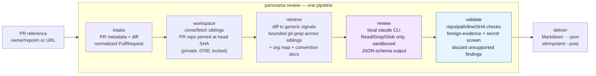

# Panorama

Panorama reviews a GitHub pull request using evidence from **sibling
repositories in the same organisation** — a rename that breaks a client, a
helper that duplicates one that already exists elsewhere, an endpoint that
ignores an org convention. A normal review only sees the one repo; Panorama
looks at the neighbours too, and cites exactly where.

It is a CLI, not a GitHub App: you run `panorama review ...` against a PR (or
a local fixture) and get a Markdown report with `repo/path:line` references,
never a copied excerpt from another repository.

**All review reasoning runs through the local Claude Code CLI (`claude`), on
your existing Claude Code subscription.** Panorama has no Anthropic API
integration of any kind — no SDK, no HTTP call, no API key. If `claude` isn't
installed and signed in, Panorama has no fallback. See `CLAUDE.md` for the
full list of constraints this project is built against.

> **Demo:** https://link.ishanavasthi.in/panorama-video

## Prerequisites

- Python 3.11+
- [`uv`](https://docs.astral.sh/uv/)
- `git` >= 2.25
- [`gh`](https://cli.github.com/), authenticated (`gh auth login`) — only
  needed once GitHub PR review lands; local fixture review doesn't use it
- [Claude Code](https://claude.com/claude-code), signed in with your
  subscription (`claude` on `PATH`)

## Setup

```bash
uv sync
uv run panorama doctor --deep
```

`doctor --deep` checks Python, git, `gh` and its auth, the `claude` CLI and
its subscription auth, the private workspace directory, and — as one live,
cheap round trip — that Panorama's sandboxed `claude` invocation can actually
read a file and return structured output. A plain `uv run panorama doctor`
skips that last round trip and reports everything else.

Both commands are read-only: they never request, read, or configure an
Anthropic API key. See `docs/m0-claude-boundary.md` for what the `claude`
invocation looks like and what was verified about it.

## Trying it on the local fixtures

Panorama ships a mock six-repository organisation — TypeScript, Python and Go —
so the core review works with no GitHub access and no cloning. Build it, then
review one of the seeded pull requests:

```bash
uv run panorama fixtures bootstrap
uv run panorama review --local acme-api --head p1-rename        # Markdown
uv run panorama review --local acme-api --head p1-rename --json # machine-readable
```

Each review runs the full pipeline: intake → workspace → deterministic
retrieval → Claude review → host evidence validation → reference-only report.
Every finding cites `repo/path:line`; findings whose evidence the host cannot
verify on disk are discarded and counted, never silently softened.

The original four seeded pull requests are:

| Branch | Repo | Seeded defect |
|---|---|---|
| `p1-rename` | acme-api | renames a response field a sibling client consumes |
| `p2-local-validator` | acme-web | reimplements a helper that already exists in a shared repo |
| `p3-endpoint-conventions` | acme-api | ignores org error-envelope and timestamp conventions |
| `p4-docs-cleanup` | acme-api | docs-only control that should raise nothing cross-repo |

V2 grew the fixture organisation to **six repositories across TypeScript, Python
and Go, with 18 labelled cases** — including five negative controls, of which
the sharpest is a rename of a module-private helper no sibling can reference.
`panorama fixtures bootstrap` builds all of them; `docs/corpus.md` explains what
each case is for and, just as importantly, what the corpus does not cover.

For how the system works under the hood — what each pipeline stage computes and
why — read **`docs/how-it-works.md`**.

## Measured quality

Retrieval quality is a number, not an impression. `panorama eval` scores which
sibling repository the deterministic pass put in front of the model, over the
18 labelled cases, with **no subscription and no network** — so it runs as a
regression gate on every commit. A change that lowers recall without a recorded
reason does not land.

```bash
uv run panorama fixtures bootstrap
uv run panorama eval                 # exits non-zero on a regression
uv run panorama eval --json          # per-case detail
```

Where it stands on the 18-case corpus, across the milestones that built it:

| Metric | Baseline | + dependency graph | + symbol index |
|---|---:|---:|---:|
| recall@1 | 0.750 | 0.750 | **0.833** |
| recall@1, ties excluded | 0.750 | 0.750 | **0.833** |
| recall@3 | 0.917 | **1.000** | 1.000 |
| MRR | 0.833 | 0.875 | **0.917** |
| file recall | 1.000 | 1.000 | 1.000 |

Every positive case has its target repository in the top three; ten of twelve
have it outright first; no negative control surfaces a single lead.

Two things this table does *not* say, both recorded in `DECISIONS.md`:

- Two contract-break cases sit at rank 2 rather than 1. Their consumers reach
  the changed service over HTTP, so nothing is declared for the structural
  channels to find, and rank fusion's blindness to magnitude lets a repository
  ranked second by two channels edge past a target ranked first by one.
- The fusion constant was swept across the whole corpus and every value above
  zero gives identical results. Zero would reach a perfect recall@1 — by turning
  those two losses into *ties*, which is worse retrieval reported with a better
  number. It was rejected for that reason.

## Evaluation against the model

The whole corpus was run through a real Claude Code subscription three times per
case — 54 reviews — scoring outcomes rather than wording, because wording varies
between runs and is not the thing being measured.

```bash
uv run panorama eval --live -k 3
```

| Measure | Result |
|---|---:|
| **False positives on negative controls** | **0.000** |
| Evidence cites the right repository | 0.846 |
| Evidence cites the right file | 0.615 |
| Category matches the label | 0.718 |
| Findings discarded by host validation, per run | 0.056 |
| Flake rate | 0.222 |

The zero is the number that matters. Across fifteen runs of five negative
controls — a docs tidy-up, a test addition, a reformat, a dependency bump, and a
rename of a private helper nothing else can reference — not one produced a
cross-repository claim.

Two caveats, both recorded rather than smoothed over. Category accuracy is the
lowest figure, and its misses are mostly *disagreements*: on two cases the model
cited the right repository and the right file but chose a different category,
and the boundary it chose is defensible. Flake is real at 22% — four cases
answered differently across three runs, which is why each case is run more than
once and why no claim here rests on a single run.

The V1 evaluation, for comparison:

| PR | Expected | Result (both passes) |
|---|---|---|
| P1 | contract break vs the consumer | `contract_break`, high, citing **acme-web** |
| P2 | duplicate of a shared helper | `duplicate_logic`, medium, citing **acme-shared** |
| P3 | convention violation | `convention` (×2), citing **acme-contracts** |
| P4 | no cross-repo impact | no findings; verdict `comment` |

Across both passes: **zero findings were discarded** (every citation the model
produced resolved to a real, in-bounds line), and the P4 control produced no
finding either time — no fabricated cross-repository impact. The only run-to-run
variance observed was on P3, where one pass additionally surfaced a low-severity
`duplicate_logic` finding (also correctly cited); the core convention findings
were stable. No prompt or retrieval tuning was required.

## Reviewing a GitHub pull request

Panorama can review a real pull request through `gh` (which must be installed
and signed in — `gh auth login`):

```bash
uv run panorama review owner/repo#123          # or a full PR URL
uv run panorama review owner/repo#123 --json
uv run panorama review owner/repo#123 --post   # also post the review as a comment
```

This runs the same pipeline as a local review. Panorama normalizes the PR (a
fork boundary is fine), clones the organisation's repositories into a private
workspace under `~/.panorama/workspaces/<owner>/` (`0700`, locked so two runs
never collide), checks the PR's own repository out at the exact reviewed commit,
and then retrieves, reviews, validates, and renders exactly as it does locally.

With `--post`, Panorama publishes the review as a **single** comment tagged with
a hidden marker: run it again and that comment is *updated*, not duplicated. It
re-reads the head SHA immediately before posting and aborts if the branch moved,
and screens the outgoing body for secrets one last time. Posting needs write
access (`--post` only); a read-only token still reviews fine.

Panorama never reads, stores, or prints a GitHub token — `gh` owns that
credential.

**Large organisations.** V1 refused above 50 repositories. V2 reads every
repository's manifest through the API *without cloning*, ranks candidates, and
clones only the top few:

```bash
uv run panorama review owner/repo#123 --clone-budget 25
uv run panorama review owner/repo#123 --all-repos   # clone everything instead
```

Every review states how many repositories were considered versus examined,
because a sibling that is never cloned is never searched and that loss would
otherwise be invisible.

## Reviewing continuously

`panorama watch` polls an owner's open pull requests and reviews the ones that
are new or whose head commit moved.

```bash
uv run panorama watch <owner>                         # dry run: reviews, posts nothing
uv run panorama watch <owner> --post --repo acme-api  # posts, only to acme-api
```

It is a poller rather than a webhook for a structural reason: a hosted service
has no Claude Code subscription, and giving it one would break both "no API key"
and "credentials stay with the tool that owns them". So reviews lag by the poll
interval and only run while the process does.

The defaults are deliberately cautious. **`--post` alone is refused** — it needs
`--repo` naming every repository it may write to. An unmoved head commit is
never re-reviewed, and the cursor lives on disk so a restart resumes rather than
re-reviewing everything. Drafts and bot-authored pull requests are skipped
(`--include-drafts`, `--include-bots`). There is a hard hourly review cap,
counted on disk so a crash-looping watcher cannot refill its own budget. Logs are
JSON on stdout; dry-run reviews go to stderr so the event stream stays parseable.

## Not repeating a rejected finding

Every finding carries a short, stable reference. Reply on the pull request to
stop seeing it:

```
panorama: dismiss a1b2c3d4e5
```

A 👎 on Panorama's comment dismisses everything that comment reported.
Suppressed findings are **counted in the report**, never silently absent.

```bash
uv run panorama suppressions list <owner>
uv run panorama suppressions clear <owner>
```

Dismissals are read from a pull request thread, which is untrusted content, so
the rule is absolute: **anything read there can only reduce what Panorama says.**
It can never add a finding, raise a severity, or alter a citation. The blast
radius of a forged dismissal is one suppressed finding, visible and reversible.

## Operating it

```bash
uv run panorama status <owner>            # cache size, cursors, suppressions
uv run panorama cache clear <owner>       # drop derived facts
uv run panorama cache clear <owner> --everything   # also cursors and dismissals
```

The cache lives at `~/.panorama/cache/<owner>.db` (`0600`) and holds derived
facts keyed by repository *and commit*, so a new commit simply misses. It is
**always safe to delete**: it can only change what gets looked at, never whether
a citation is real, because every citation is validated against the live
checkout on every run with no cache in that path.

For CI, `--fail-on` exits **5** when a finding survives at or above a severity:

```bash
uv run panorama review owner/repo#123 --fail-on high
```

Exit 5 is deliberately distinct from every error code — "the tool broke" and
"the tool worked and you should look" are different outcomes, and a job that
cannot tell them apart ends up ignoring both.

## Seeding a live demo

To show the whole thing end to end on real GitHub, seed the mock organisation as
private repositories in an account you control:

```bash
uv run panorama demo --github <your-user-or-org>
```

This **creates one private repository per fixture repo** (`acme-api`,
`acme-web`, `acme-shared`, `acme-contracts`, `acme-analytics`, `acme-gateway`)
and opens a pull request for each seeded change — the same defects the offline
evaluation uses. It always confirms before writing (pass `--yes` to skip the
prompt).

To refresh an organisation you have already seeded — after the fixtures change,
or to add repositories that did not exist before:

```bash
uv run panorama demo --github <your-user-or-org> --update
```

`--update` force-pushes the current fixture data into the existing repositories
and opens only the pull requests that are missing, **keeping existing pull
requests and their review comments**. `--recreate` deletes and rebuilds instead,
which needs the `delete_repo` scope. Then review a seeded PR live, optionally
posting the result back:

```bash
uv run panorama review <your-user-or-org>/acme-api#1 --post
```

## Architecture

One pipeline runs for every review, regardless of where the PR came from:



Key properties:

- **Two sources, one shape.** A local fixture branch and a GitHub PR both
  normalize to the same `PullRequest`, so retrieval, review, validation, and
  delivery never learn where the PR came from — the GitHub path only changes how
  the repositories land on disk.
- **Retrieval orients, the model confirms, the host verifies.** Deterministic
  code finds likely cross-repo context; Claude reviews with that context;
  then host code re-checks every citation against the real files. A finding
  whose evidence doesn't resolve is **discarded, never downgraded**.
- **The Claude boundary defines the security model.** The only AI integration
  is the local `claude` CLI on its subscription — no SDK, no HTTP, no API key.
  It runs read/search-only, with the user's personal config, plugins, and MCP
  servers disabled, scoped to the workspace, under a wall-clock timeout. The
  boundary was verified empirically; see `docs/m0-claude-boundary.md`.
- **Reference-only by construction.** The output schema has no field for a
  source excerpt, so a finding can only ever be a `repo/path:line` pointer —
  safe to post on a repo whose readers can't see the cited repo's source.

## Major decisions

The full reasoning, milestone by milestone, is in `DECISIONS.md`. In brief:

- **A CLI, not a GitHub App.** The hard problem is *finding cross-repo
  context*, not delivery plumbing; the same pipeline wraps in a webhook later.
  The assignment explicitly permits a CLI that can become a bot.
- **The model reads the repositories directly, and the host checks its answers.**
  Rather than feeding the model only pre-selected snippets (blind to whatever
  retrieval missed) or letting it roam unverified (free to invent citations), it
  does both — and every citation is re-checked against the real files, with
  failures **discarded, never downgraded**.
- **Lexical retrieval, not embeddings.** Explainable — every surfaced repo is
  justified by which signal matched which line — with no index to build or drift.
- **Findings cite locations; they never quote code.** Reference-only output is
  safe to post on a repo whose readers can't see the cited repo's source.

## Known limitations

Measured or accepted, so they can be stated rather than discovered:

- **Two contract-break cases rank their target second, not first.** Their
  consumers reach the changed service over HTTP, so no manifest and no import
  statement records the coupling, and both structural channels are silent. Rank
  fusion is blind to magnitude, so a repository ranked second by two channels
  edges past a target ranked first by one. Understood, recorded, and not fixable
  by tuning — see `DECISIONS.md`.
- **Cross-language duplicate detection barely works.** `format_timestamp` and
  `formatTimestamp` are different strings and no ranking makes them one. The one
  case that tests it is winnable only because a shared constant is spelled
  identically in both languages.
- **Category accuracy is 0.718**, the weakest live number. Most misses are
  disagreements about a genuinely fuzzy boundary — a new UTC formatter both
  duplicates a helper *and* touches the timestamps convention — rather than
  wrong locations.
- **Model output varies between runs: 22% flake.** Host validation bounds the
  *correctness* of findings, not their run-to-run *consistency*. This is why the
  live evaluation runs every case three times.
- **Selection can silently drop a relevant repository** on organisations larger
  than the clone budget, when nothing declares the coupling. Never silent in the
  report — considered-versus-examined counts are printed every run, and
  `--all-repos` undoes it.
- **Symbol extraction is regex, not a parser.** A comment delimiter inside a
  string literal confuses it and costs some recall. That loss is safe in the
  direction that matters: a symbol not indexed is a lead not offered, never a
  citation invented.
- **A reworded finding title is a new finding**, so a dismissal can need
  repeating. Deliberate: collapsing similar titles would risk silencing a
  genuinely new finding, which is the worse failure.
- **The watcher only runs while your machine does**, and reviews lag by the poll
  interval. That is a consequence of the subscription constraint, not a gap.
- **Giving the model read access to private source is an intentional
  trade-off** — mitigated by read-only sandboxing, owner-only `0700` storage,
  prompt-injection treatment, and reference-only output, not eliminated.
- **One summary comment**, no inline diff comments, no automatic fixes. Absence
  of a finding is not proof of safety — Panorama is a reviewer's assistant, not
  a merge gate.

## Future work

- **Read HTTP contracts as a first-class signal.** Route strings and response
  field names are the coupling both structural channels miss, and they are the
  remaining headroom in retrieval.
- **Inline line-level review comments**, deferred because a review with inline
  comments is not idempotent the way a single edited summary comment is.
- **Tree-sitter instead of regex**, if measurement ever shows extraction recall
  is the binding constraint. A measured upgrade, not a speculative one.
- **Co-change coupling**, built and shipped disabled, waiting on a real
  organisation with genuine history to measure it against.
- **Permission-aware evidence**, so a cited location respects who can see which
  repository.

## Use of AI tools during development

AI tools were used throughout development as a coding assistant — scaffolding
modules, writing tests, and drafting documentation — with architecture,
milestone sequencing, and every security boundary directed and reviewed by the
author. One milestone (M0) was subjected to an adversarial AI review that
surfaced two security defects the passing test suite had missed. In the shipped
product, the sole runtime AI dependency is the local Claude Code CLI that
performs the review.

## Status

**V2, feature-complete.** V1 shipped a working cross-repository reviewer; V2
made its quality measurable, then measurably better, then able to run
unattended.

| Command | What it does |
|---|---|
| `panorama doctor [--deep]` | Environment and sandbox checks |
| `panorama fixtures bootstrap` | Build the six-repository mock organisation |
| `panorama review` | Review a local fixture or a GitHub PR |
| `panorama eval [--live -k N]` | Score retrieval, and optionally the model |
| `panorama watch <owner>` | Poll and review continuously, dry-run by default |
| `panorama status <owner>` | What is held locally: cache, cursors, dismissals |
| `panorama cache clear <owner>` | Reset derived state |
| `panorama suppressions list\|clear` | Inspect and undo dismissals |
| `panorama demo --github <owner>` | Seed a live private demo |

`v2plan.md` has the build order, `CHECKLIST.md` the status of every milestone
including what was dropped and why, `DECISIONS.md` the reasoning and the
measurements, `docs/how-it-works.md` the mechanism, and `docs/corpus.md` the
ground truth quality is measured against.

Not done, and honest about it: the two live `watch` checks need a seeded demo
organisation, and inline review comments were dropped in favour of the
fingerprint and suppression work in the same milestone.
